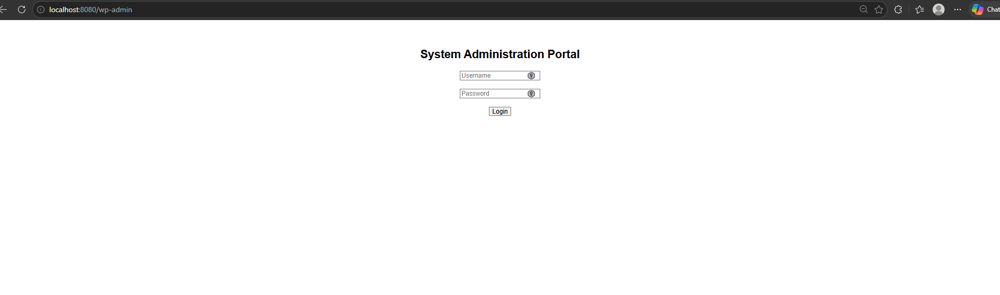
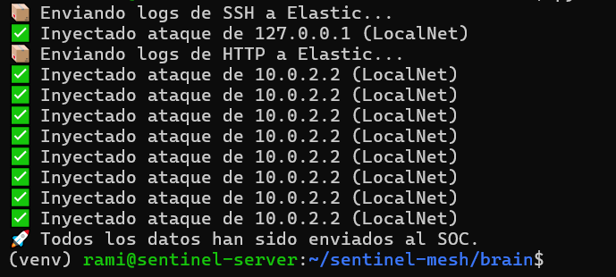
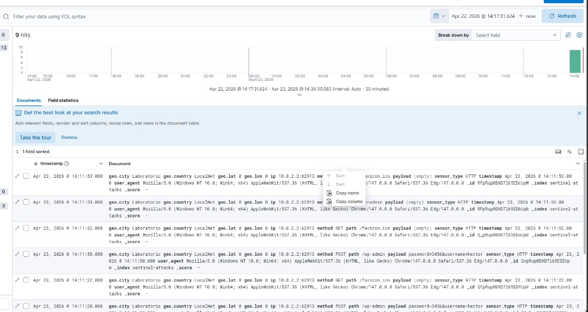

# 🕸️ Sentinel Mesh
**Honeynet Distribuida e Inteligencia de Amenazas Nativa en la Nube**


Sentinel Mesh es una arquitectura de honeynet modular diseñada para capturar, analizar y alertar sobre actividad maliciosa en tiempo real. El sistema simula servicios vulnerables para atraer atacantes, extrae sus credenciales y geolocaliza su origen.
---

## 🏗️Arquitectura del Sistema
La plataforma se compone de tres capas integradas:

Sensores Activos (Go): Honeypots ligeros de alta concurrencia:

Sensor-SSH: Emula un servidor SSH en el puerto 2222, capturando intentos de fuerza bruta.

Sensor-HTTP: Simula paneles de administración (WordPress, phpMyAdmin) y trampas .env.

Sensor-Telnet: Captura intentos de acceso en protocolos heredados.

Cerebro / Shipper (Python): Motor de procesamiento que realiza:

Enriquecimiento GeoIP: Localización de ataques por país y ciudad.

Análisis Forense: Extracción de usuarios y contraseñas probados por los atacantes.

Alertas Críticas: Notificaciones instantáneas vía Telegram.

SOC Central (Docker): Pila Elastic (Elasticsearch y Kibana) para visualización de mapas y métricas de ataque.

🔥 Características Principales
Captura de Credenciales: Registro detallado de user y password utilizados en ataques de fuerza bruta.

Alertas en Tiempo Real: Notificaciones inmediatas a dispositivos móviles mediante Telegram Bot API.

Visualización Geoespacial: Mapas de calor en Kibana para identificar el origen geográfico de las amenazas.

Persistencia con Systemd: Configurado para arrancar automáticamente como servicio del sistema.
---

## 🚀 Inicio Rápido

### Levantando el SOC
```bash
cd dashboard
docker-compose up -d
```

### Ejecutando Sensores
```bash
# En terminales separadas:
go run sensor-ssh/cmd/main.go
go run sensor-http/cmd/main.go
```
## 📸 Panel falso de Incio de sesion


### Procesando Inteligencia
```bash
cd brain
source venv/bin/activate
python shipper.py
```

---

## 📸 Vista Previa del Panel


## 📸 Logs 


## 📱 Alertas en Telegram


---

🛠️ Instalación como Servicio (Producción)
Para mantener Sentinel Mesh activo 24/7 tras reinicios:
sudo cp deployment/*.service /etc/systemd/system/
sudo systemctl daemon-reload
sudo systemctl enable --now sentinel-shipper sentinel-http sentinel-ssh sentinel-telnet
---

🚀 Despliegue en AWS (EC2)
El sistema está diseñado para ejecutarse de forma autónoma en una instancia Ubuntu Server 22.04 LTS en Amazon Web Services.

🛡️ Configuración de Red (Security Groups)
Para el correcto funcionamiento del SOC, se han abierto los siguientes puertos:

2222 (TCP): Acceso SSH administrativo (real).

22 (TCP): Sensor Honeypot SSH (cebo).

2323 (TCP): Sensor Honeypot Telnet (cebo).

8080 (TCP): Sensor Honeypot HTTP (cebo).

5601 (TCP): Acceso web al Dashboard de Kibana.

🔄 Persistencia y Automatización
Para garantizar que los sensores y el sistema de alertas se inicien automáticamente tras un reinicio del servidor, se utiliza un script de inicio y una tarea programada en cron.

Script de inicio (iniciar_SOC.sh): Centraliza el arranque de todos los sensores (Go) y el script de envío de alertas (Python) en segundo plano.

Crontab: Se ha configurado la instrucción @reboot para ejecutar el script de inicio de forma automática al arrancar el sistema.

📊 Visualización
Los datos capturados se inyectan en tiempo real en un stack de Elasticsearch y se visualizan a través de un Dashboard personalizado en Kibana, permitiendo el análisis geográfico de los ataques y el estudio de las credenciales más utilizadas por los bots.
---
## ⚠️ Aviso Legal
Proyecto educativo. No desplegar en entornos de producción sin el aislamiento adecuado.
