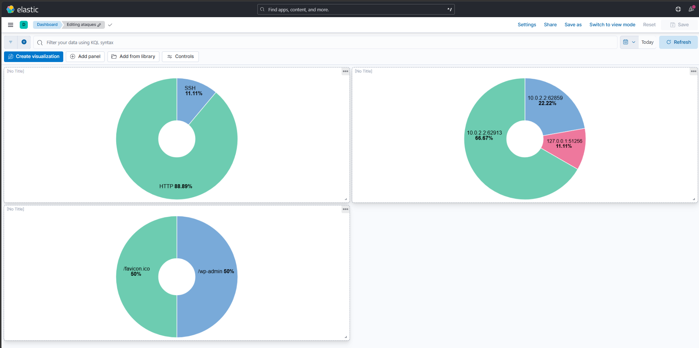

# 🕸️ Sentinel Mesh
**Honeynet Distribuida e Inteligencia de Amenazas Nativa en la Nube**


Sentinel Mesh es una arquitectura de *honeynet* modular y ligera diseñada para capturar, enriquecer y visualizar la actividad maliciosa de red en tiempo real. Integra Inteligencia de Amenazas (Threat Intelligence y GeoIP) de forma automatizada y envía los datos a un panel centralizado (SOC).

---

## 🏗️ Resumen de la Arquitectura

La plataforma se divide en tres capas:

1. **Sensores (Go):** Honeypots de alta concurrencia.
   - `Sensor-SSH`: Captura fuerza bruta en el puerto 2222.
   - `Sensor-HTTP`: Simula paneles vulnerables y registra ataques web.
2. **Cerebro (Python):** Motor que procesa logs JSON y geolocaliza las IPs de los atacantes.
3. **SOC Central (Docker):** Pila Elastic (Elasticsearch y Kibana) para visualizar ataques en tiempo real.

---

## 🚀 Inicio Rápido

### Levantando el SOC
```bash
cd dashboard
docker-compose up -d
```

### Ejecutando Sensores
```bash
# En terminales separadas:
go run sensor-ssh/cmd/main.go
go run sensor-http/cmd/main.go
```


### Procesando Inteligencia
```bash
cd brain
source venv/bin/activate
python shipper.py
```

---

## 📸 Vista Previa del Panel


---

## ⚠️ Aviso Legal
Proyecto educativo. No desplegar en entornos de producción sin el aislamiento adecuado.
